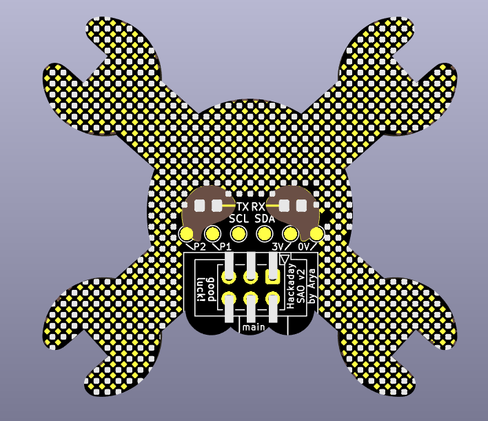

# Jolly Wrencher SAO

This is a Jolly Wrencher SAO, loosely adherent to [SAO v1.69bis](https://hackaday.com/2019/03/20/introducing-the-shitty-add-on-v1-69bis-standard/).

It accepts both SMD and through-hole 2.54mm (0.1") pitch connectors.
For the Supercon 2022 badge, you will want to populate at least the "main" section
(marked on the silkscreen) - extra pins will be handy if you want to use this SAO
with some of the 6-pin connector badges.

On the back, it has as much prototyping space as I could fit in there, on a 1.27mm (0.05") grid,
non-connected pads diagonally interspersed with GND pads for easier prototyping.
There's no through-holes because I didn't want to ruin the front of the badge.
You should be able to fit an ESP32 SMD module on there, for instance - I haven't considered this usecase
specifically, but I think its pins are on 1.27mm grid?

There's also 0805 footprints for LEDs behind the eyes, with the eyes themselves
being transparent - mask, silk and copper removed. I hope it's not going to look awful.
The 0805 footprints, being "handsoldering" and wider, should be 0603-compatible.
I also wish you personally that the eye portion of the FR4 on your badge won't bear any
marks that are often put on the surface of bare (exposed) FR4.
One side of these LEDs is connected to VCC, the other, you'll want to connect to GND
with some resistor - there's no extra resistor footprint, but GND pads are very much nearby!

There's a `^^` version in this repository, which has `^ ^` instead of the usual Wrencher eyes.
That's the only difference. I'm making that one for myself and my friends, you order whatever.
The `svgs/` folder contains source SVGs and some random in-progress stuff, didn't want to clean it up.

Hackaday, Hack A Day, and the Skull and Wrenches Logo are Trademarks of Hackaday.com.

If you're ordering from JLCPCB and they send you an email saying that they'd like you
to upgrade to ENIG, see [JLCPCB_SPEECH_CHECK.md](./JLCPCB_SPEECH_CHECK.md).
Of course, you can also upgrade to ENIG, I'm not your mom or something.

- Signal names are silkscreened on the board's bottom layers.
- This board is untested and there's no guarantees of fitness.

- Software: Kicad 6
- Version: 2 (I published v1 on Discord somewhere, who knows if it got ordered by someone, warrants a bump)
- PCB size: 47.93mm*43.85mm  (JLCPCB said so, idk how to properly measure an arbitrary shape PCB in KiCad)
- Layer count: 2
- Recommended thickness: whatever, maybe not 0.8mm? I ordered 1.2mm IIRC
- Recommended silkscreen color: black
